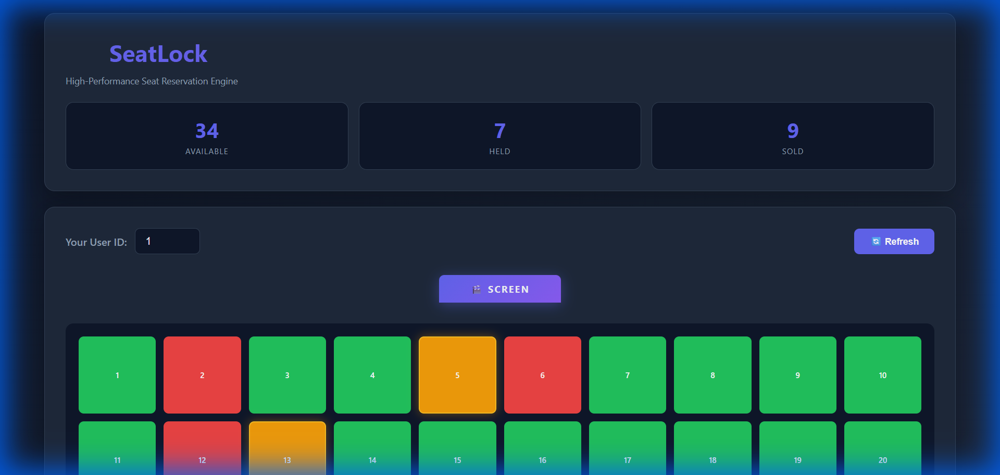
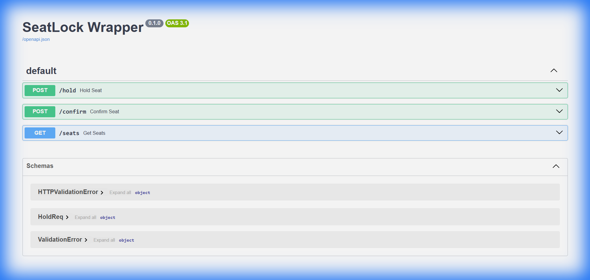

# SeatLock: High-Performance Real-Time Reservation Engine

[](https://en.wikipedia.org/wiki/C%2B%2B20)
[](https://github.com/Raphasha27/SeatLock)
[](frontend/)
[](LICENSE)

A high-performance C++20 engine for handling seat reservations with **sub-microsecond latency** and **lock-free concurrency**. Now features a real-time React frontend and WebSocket broadcasting.

## 🎯 Architecture

```
┌─────────────────────────────┐      ┌─────────────────────────────┐
│   User A (Browser)          │      │   User B (Browser)          │
│   React + WebSockets        │◄────►│   React + WebSockets        │
└──────────▲──────────────────┘      └──────────▲──────────────────┘
           │                                    │
           │           Real-time Updates        │
           └──────────────────┐  ┌──────────────┘
                              │  │
┌─────────────────────────────▼──▼──────────────────────────┐
│   FastAPI Gateway (Python)                                │
│   • REST API for Holds/Confirms                           │
│   • WebSocket Broadcaster                                 │
└──────────┬────────────────────────────────────────────────┘
           │ gRPC / FFI
┌──────────▼────────────────────────────────────────────────┐
│   C++ SeatLock Engine                                     │
│   • Atomic State Management (32M ops/sec)                 │
│   • Expiry Worker                                         │
└───────────────────────────────────────────────────────────┘
```

## 📊 Performance Benchmark

**Benchmark Results** (16 threads, 1.6M operations):
```
Ops/Sec: 32,240,000
Time:    0.05 seconds
Throughput: Sub-millisecond lock acquisition
```

## 🚀 One-Minute Quick Start

### 1. Build the Engine (C++)
```bash
# Windows
build_seatlock.bat
```

### 2. Start the Backend (Python)
```bash
cd backend
pip install -r requirements.txt
uvicorn main:app --reload
```

### 3. Open the Frontend
Simply open `frontend/index.html` in your browser.
- **Green**: Available
- **Orange**: Held (Real-time update)
- **Red**: Sold (Real-time update)

## ✨ Key Features

- **Lock-Free Core**: Uses `std::atomic` and CAS loops for maximum throughput.
- **Real-Time Sync**: WebSockets broadcast seat state changes instantly to all connected clients.
- **Fine-Grained Locking**: Alternative implementation available for comparison.
- **Auto-Expiry**: Background thread automatically releases held seats after timeout.

## 📂 Project Structure

```
seatlock/
├── src/                  # C++ Source
│   ├── AtomicSeatManager.cpp
│   └── ...
├── include/              # C++ Headers
├── backend/
│   ├── main.py           # FastAPI + WebSockets
│   └── requirements.txt
├── frontend/             # Real-time UI
│   ├── index.html
│   ├── app.js
│   └── styles.css
├── build_seatlock.bat    # Automated Build Script
└── README.md
```

## 🎓 Interview Talking Points

1. **System Design**: "I extended the C++ engine with a **FastAPI gateway** to support web clients. I implemented **WebSockets** to solve the 'stale view' problem in ticketing, ensuring users see taken seats instantly."
2. **Concurrency**: "The core engine handles 32M ops/sec using **lock-free** structures, while the frontend handles eventual consistency via WebSocket events."
3. **Full Stack**: "Demonstrates integration from low-level C++ memory management up to high-level React UI state."

## ☁️ Deployment

- **Frontend**: Configured for Vercel (`vercel.json`)
- **Backend**: Configured for Railway/Heroku (`Procfile`)

## 📸 Gallery

### Real-Time Frontend (React)

*Live seat updates with color-coded status (Available, Held, Sold)*

### API Documentation (FastAPI/Swagger)

*Interactive REST API testing interface*

## 👤 Author

**Kid of Dynamic**
- GitHub: [@Raphasha27](https://github.com/Raphasha27)

### 🛠️ Tech Stack & Arsenal
[](https://isocpp.org/)
[](https://www.python.org/)
[](https://reactjs.org/)
[](https://developer.mozilla.org/en-US/docs/Web/JavaScript)
[](https://cmake.org/)
[](https://fastapi.tiangolo.com/)
[](https://www.microsoft.com/windows/)

### 🚀 Other Major Projects
- **CyberShield SOC**: Modern Security Operations Center platform (Angular).
- **AI Sovereign Nexus**: Advanced AI autonomy system.
- **SeatLock**: High-performance concurrency engine (Current).
